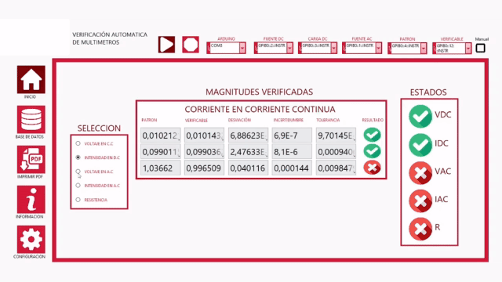
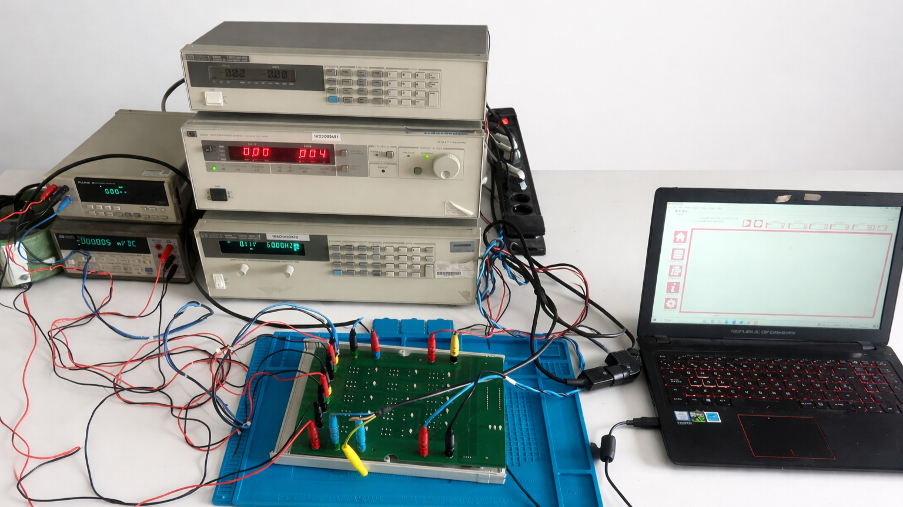

# Automated Multimeter Verification System

An end-to-end automated test bench for high-precision verification and calibration of digital multimeters, designed and developed from scratch. Typically used in calibration laboratories, industrial quality control, and electronic test environments.

The system replaces manual, time-consuming verification procedures with a fast, reliable, and fully traceable automated solution, ensuring high measurement consistency and repeatability across all test runs.

---

## System in Action

| Physical Layer (Switching) | Software Layer (Orchestration) |
| :---: | :---: |
|  |  |
| *Real-time hardware relay matrix actuation.* | *LabVIEW HMI: real-time state management..* |

---

## System Overview

**Operational Pipeline:**
`DUT Interface` → `Standard Synchronization (GPIB)` → `Real-time Orchestration (LabVIEW)` → `Relational Persistence (PostgreSQL)` → `Automated Post-processing (Python)`

  
  
<em>Physical verification station: reference instrumentation, custom switching matrix, and automated control.</em>

---

## Technical Architecture

The system is organized into four fundamental layers:

  
  
<em>Functional block diagram: hardware-software-data synchronization and communication protocols.</em>

### 1. Equipment & Instrumentation Layer
- NI-VISA over GPIB (IEEE-488.2) for high-stability reference standards.
- HP 34401A as the metrological reference pattern.

### 2. Hardware & Physical Layer
- Custom 4-layer PCB with high-isolation relay matrix for signal integrity.
- Arduino Nano (ATmega328P) via SPI (LINX) for sub-millisecond actuation latency.

### 3. Software & Execution Layer
- LabVIEW Queued Message Handler (QMH) for asynchronous execution and UI responsiveness.
- Deterministic polling and real-time pass/fail validation against programmable tolerances.

### 4. Database & Analytics Layer
- PostgreSQL relational database hosted on a Raspberry Pi 5 edge node.
- CLI-driven Python pipeline (ReportLab / psycopg2) for batch PDF certificate generation.

---

## System Performance

- Reduced verification time from ~30 minutes (manual process) to ~5 minutes with automated reporting.
- Measurement repeatability: <0.1% standard deviation across 10 consecutive runs.
- Relative measurement error: <0.5% for most voltage, current, and resistance ranges.
- Fully automated data logging and report generation.

---

## Repository Navigation

| Module | Technical Focus | Documentation |
| :--- | :--- | :---: |
| **Architecture** | Layered orchestration and system-wide design | [Explore](architecture/architecture.md) |
| **Hardware** | PCB design, switching matrix, and power electronics | [Explore](hardware/hardware.md) |
| **Software** | LabVIEW logic, message handling, and execution flow | [Explore](software/software.md) |
| **Database** | SQL relational schema and traceability models | [Explore](database/database.md) |
| **Communications** | GPIB, SPI, and ODBC interface specs | [Explore](communications/communications.md) |
| **Results** | Metrological validation, error analysis, and ROI | [Explore](results/results.md) |

---

## Scope & Constraints

- **Capabilities:** Full autonomous verification, real-time tolerance validation, and batch report generation.
- **Limitations:** This is a verification platform — it does not perform internal firmware calibration of the DUT.
- **Standardization:** Performance is benchmarked against the calibration status of the reference multimeter.

---

## Engineering Challenges

- Maintaining signal integrity in a relay-based switching matrix.
- Synchronizing GPIB instrumentation with deterministic execution timing.
- Designing a scalable and traceable database schema.
- Ensuring real-time responsiveness while logging and reporting asynchronously.

---

## Project Context

Developed as a Final Degree Project (TFG), covering the complete system lifecycle from design to implementation and validation.

---

## License

Academic Final Degree Project (TFG).
This repository serves as a technical portfolio reference.
Source code and proprietary schematics are not publicly released.
