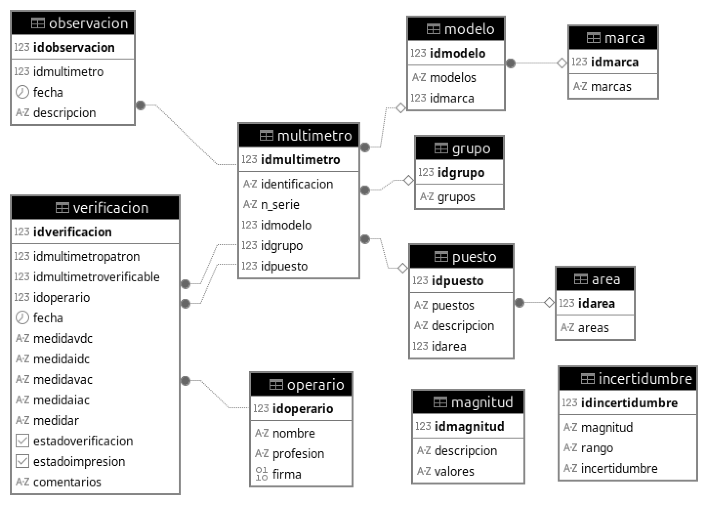

## Overview

This document defines the relational database architecture designed to manage the lifecycle of the automated multimeter verification process. The database ensures 100% traceability by linking devices under test (DUT), reference standards, operators, and environmental measurement data.

The system facilitates:
* Centralized asset management (Multimeter registry).
* Persistent storage of high-resolution verification results.
* Measurement history and uncertainty model mapping.
* Automated data sourcing for Python-based PDF reporting.

---

## Technology Stack

| Component | Specification | Rationale |
| :--- | :--- | :--- |
| **Database Engine** | PostgreSQL (Relational DBMS) | ACID compliance and robust referential integrity |
| **Server Hardware** | Raspberry Pi 5 (8 GB RAM) | Dedicated low-power edge computing node |
| **Operating System** | Raspberry Pi OS (64-bit) | Linux-based stability for persistent services |
| **Interface Protocol** | ODBC (32-bit) | Standardized middleware for LabVIEW-to-SQL communication |
| **Driver** | psqlODBC | High-performance PostgreSQL Wire Protocol implementation |

---

## Server Deployment and Configuration

The PostgreSQL instance is hosted on a dedicated Linux node. The following configuration ensures secure LAN-based access for the LabVIEW control station:

### Installation and Service Management
```
# Core package installation
sudo apt update && sudo apt install postgresql postgresql-client

# Service persistence configuration
sudo systemctl enable postgresql
sudo systemctl start postgresql
```
### Network and Security Hardening

The `postgresql.conf` and `pg_hba.conf` files were modified to allow controlled remote connections:

* **Listener Configuration:** `listen_addresses = '*'` to enable network interfacing.
* **Authentication:** Implementation of `scram-sha-256` for encrypted password exchange.
* **Access Control:** Subnet filtering to restrict connections to authorized workstations only.

---

## Entity-Relationship (ER) Model

The schema follows a hierarchical normalization strategy to minimize redundancy and ensure data consistency across the laboratory inventory and test results.

<div align="center">
  
  <p><em>Standardized ER Diagram illustrating relational dependencies and referential integrity.</em></p>
</div>

---

## Data Dictionary (Core Schemas)

### Table: `multimeter` (Asset Registry)

| Column | Type | Constraints | Description |
| :--- | :--- | :--- | :--- |
| **idmultimeter** | SERIAL | PRIMARY KEY | Unique internal identifier |
| **identification** | VARCHAR(50) | UNIQUE, NOT NULL | Corporate asset tag |
| **serial_number** | VARCHAR(50) | UNIQUE, NOT NULL | OEM Serial Number |
| **idmodel** | INTEGER | FOREIGN KEY | Link to device specifications |
| **idgroup** | INTEGER | FOREIGN KEY | Metrological categorization |
| **idworkstation** | INTEGER | FOREIGN KEY | Current physical deployment |

### Table: `verification` (Metrological Results)

This table acts as the central repository for all automated test runs.

| Column | Type | Constraints | Description |
| :--- | :--- | :--- | :--- |
| **idverification** | SERIAL | PRIMARY KEY | Unique test run ID |
| **idpattern** | INTEGER | FOREIGN KEY | Reference standard used |
| **iddut** | INTEGER | FOREIGN KEY | Device Under Test (DUT) identifier |
| **idoperator** | INTEGER | FOREIGN KEY | Technician responsible for the execution |
| **t_stamp** | TIMESTAMP | NOT NULL | ISO-8601 execution timestamp |
| **measurements_VDC** | TEXT | NOT NULL | Semicolon-delimited vector: DC Voltage readings |
| **measurements_IDC** | TEXT | NOT NULL | Semicolon-delimited vector: DC Current readings |
| **measurements_VAC** | TEXT | NOT NULL | Semicolon-delimited vector: AC Voltage readings |
| **measurements_IAC** | TEXT | NOT NULL | Semicolon-delimited vector: AC Current readings |
| **measurements_R** | TEXT | NOT NULL | Semicolon-delimited vector: Resistance readings |
| **status** | BOOLEAN | NOT NULL | Global metrological result (PASS/FAIL) |
| **report_flag** | BOOLEAN | DEFAULT FALSE | Automated PDF certificate generation status |
| **observations** | VARCHAR(255) | DEFAULT NULL | Qualitative remarks regarding the test process |

> **Note:** Measurement vectors are stored as semi-structured delimited strings, optimizing LabVIEW's sequential block-write performance and decoupling the high-frequency acquisition layer from relational overhead. Full normalization is deferred to the reporting layer via Python post-processing.

---

## Metrological Validation Logic

The verification status is calculated using a deterministic algorithm that factors in both device error and measurement uncertainty:

$$Error = |Pattern Reading - DUT Reading|$$

$$Limit = (Pattern Reading · Tolerance Class) + Expanded Uncertainty$$

**Status = PASS** if $Error \leq Limit$, otherwise **FAIL**.

<div align="center">
  
  <p><em>Algorithmic flow for real-time pass/fail decision making based on metrological tolerances.</em></p>
</div>

---

## Data Flow and Integration

The following diagram illustrates the lifecycle of a single measurement, from the physical instrument acquisition to the persistent storage and final report generation.

<div align="center">
  
  <p><em>End-to-end data flow: Acquisition (GPIB) → Orchestration (LabVIEW) → Persistence (SQL) → Reporting (Python).</em></p>
</div>

---

## System Constraints and Evolution

### Current Constraints
* **Storage Pattern:** Measurement data is semi-normalized; while efficient for I/O, it limits complex SQL-side statistical queries.
* **Redundancy:** Local storage only; no active-passive replication implemented.
* **Hardware:** Performance is bound by the I/O throughput of the Raspberry Pi 5 storage medium.

### Future Roadmap
* **Full Normalization:** Decouple measurement vectors into a dedicated `observation_points` table for granular SQL analytics.
* **Automated Backups:** Implementation of scheduled `pg_dump` tasks for remote archival.
* **Security Layer:** Integration of Role-Based Access Control (RBAC) at the database level.

---

## Summary

The database layer provides a high-integrity relational backend for the automated verification system. By centralizing asset data, measurement results, and metrological references, the system achieves full traceability and compliance with industrial standards. The architecture is designed to be hardware-agnostic and scalable, supporting the transition from a single test station to a multi-node laboratory environment.
