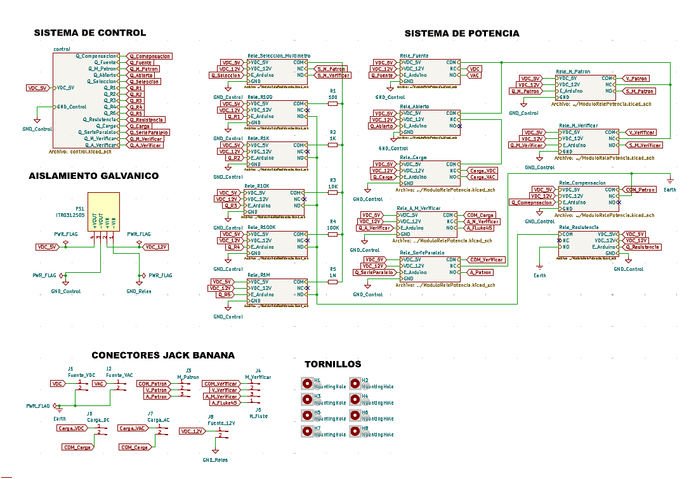
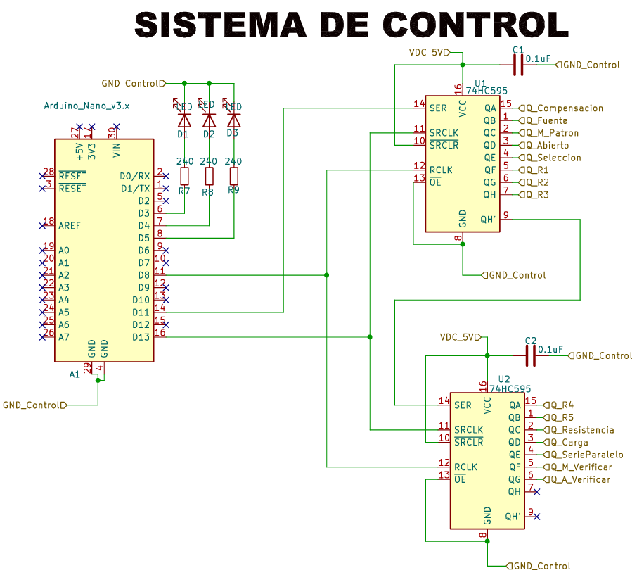
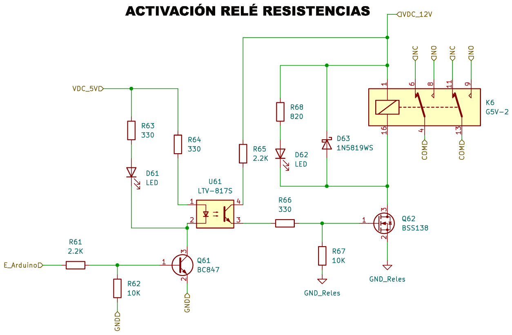
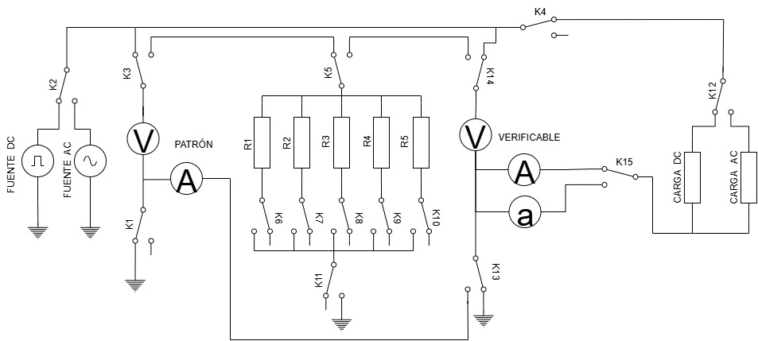
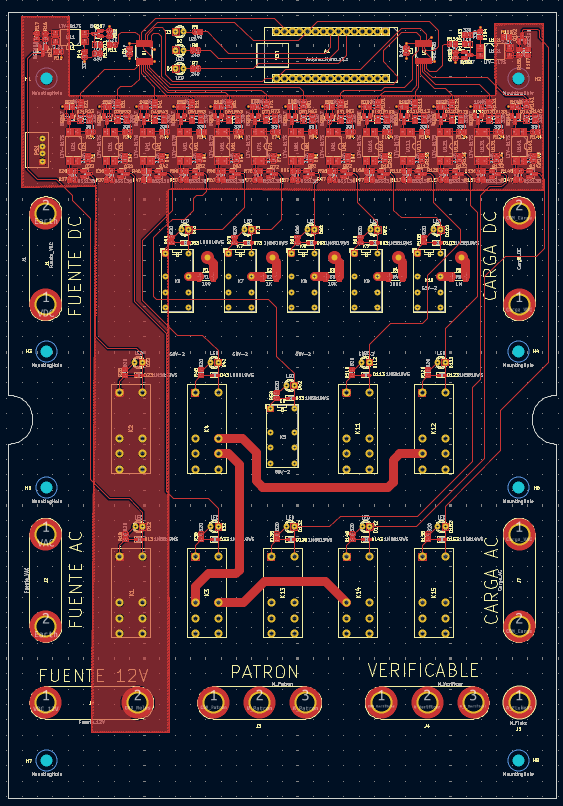
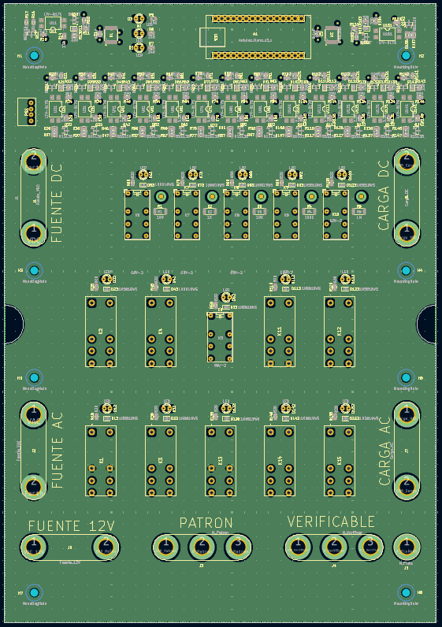
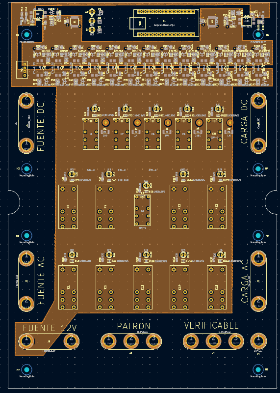
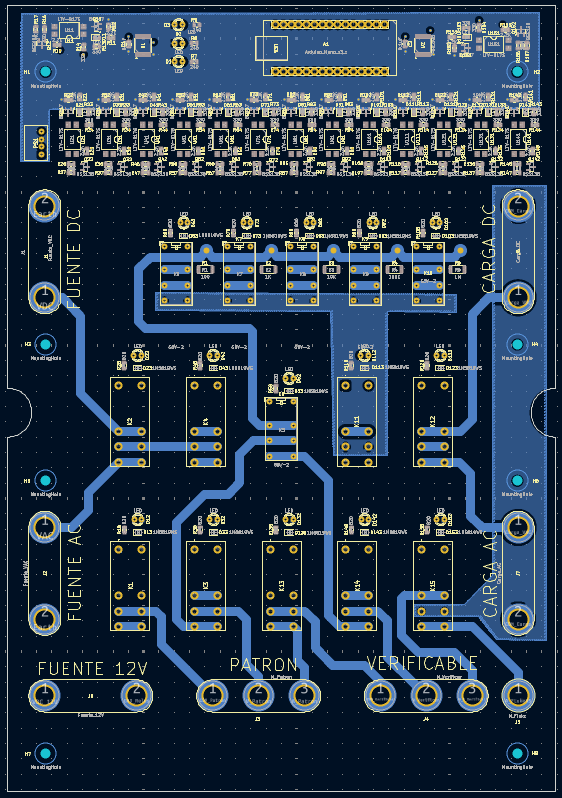

# Hardware — Automated Multimeter Verification System

## Overview

This document details the design and implementation of the custom hardware control platform. The system functions as the physical switching matrix between the software orchestration layer and the electrical instrumentation, routing signals between high-precision sources, loads, and Devices Under Test (DUT) based on the active measurement profile.

The system is integrated into a **1598HGY industrial-grade enclosure**, ensuring electrical protection, EMI shielding, and operator safety.

---

## Operating Specifications

* **Voltage Range (DC/AC):**
  * Functional range: 0.1 V to 100 V
  * Maximum rating: 250 V (Isolation limited)
* **Current Range (DC/AC):**
  * Functional range: 10 mA to 1 A
  * Maximum rating: 5 A (Trace width limited)
* **Precision Resistance Network:**
  * Values: 100 Ω, 1 kΩ, 10 kΩ, 100 kΩ, 1 MΩ
  * Tolerance: High-precision resistors for verification stability.

---

## Hardware Architecture

The platform architecture is segmented into three isolated domains to ensure signal integrity and safety:

1. **Logic Control Stage (5 V):** Low-power digital signals.
2. **Relay Driver Stage (12 V):** Power amplification and galvanic isolation.
3. **Power Switching Stage:** High-voltage/high-current measurement routing.

---

## Electrical Design (KiCad)

  
  
<em>Full system schematic designed in KiCad.</em>

---

## Logic Control Stage

The digital core is centered around an **Arduino Nano (ATmega328P)**. To optimize I/O usage, two **74HC595 shift registers** are cascaded, expanding the digital output capacity to 16 lines using a 3-pin SPI-based communication interface.

  
  
<em>Logic stage: MCU and shift register cascade.</em>

---

## Relay Driver and Isolation Stage

To protect the logic core from inductive spikes and switching noise, a multi-stage isolation strategy was implemented for each control line:

* **Signal Pre-amplification:** NPN Transistor (BC847).
* **Galvanic Isolation:** Optocoupler (LTV-817S) to decouple logic and power grounds.
* **Power Actuation:** Logic-level MOSFET (BSS138) for relay coil driving.
* **Protection:** Flyback diodes (1N5819WS) to suppress back-EMF during de-energization.

  
  
<em>Isolation and driver stage schematic.</em>

---

## Power Switching and Signal Routing

This stage manages the physical connection between the instrumentation and the DUT. The relay matrix is programmed to configure the circuit topology dynamically:

* **Series Configuration:** Dedicated to current (A) measurement verification.
* **Parallel Configuration:** Optimized for voltage (V) and resistance (Ω) verification.

  
  
<em>Power stage: Signal routing and topology configuration.</em>

---

## PCB Engineering and Manufacturing

The PCB was developed in **KiCad** and manufactured by **JLCPCB** using a 4-layer stack-up to optimize signal integrity and power distribution.

### PCB Layout and Planes

| Top Layer (Signal/Comp) | Ground Plane (Inner 1) |
| :---: | :---: |
|  |  |
| **Power Plane (Inner 2)** | **Bottom Layer (Signal/GND)** |
|  |  |

### PCB Stack-Up Specification

| Layer | Function | Copper Weight |
| :--- | :--- | :--- |
| **Top** | Component placement and high-speed routing | 1 oz (35 µm) |
| **Inner 1** | Dedicated Ground Plane (EMI reduction) | 0.5 oz (17.5 µm) |
| **Inner 2** | Power Distribution (5 V / 12 V) | 0.5 oz (17.5 µm) |
| **Bottom** | Power routing and auxiliary grounding | 1 oz (35 µm) |

---

## Design Rules and Compliance

* **Trace Widths:** Control signals at 0.4 mm; Power traces up to 3.0 mm for thermal management.
* **Safety Standards:** IPC-2221 compliant spacing for high-voltage nets.
* **Isolation Strategy:** Physical separation (milling/slots) between high-voltage and low-voltage domains to increase **creepage and clearance** distances.
* **Testing:** 100% DRC (Design Rule Check) and ERC (Electrical Rule Check) pass prior to fabrication.

---

## External Instrumentation Integration

| Instrument | Model | Functional Role |
| :--- | :--- | :--- |
| **Reference Multimeter** | HP 34401A | Primary Measurement Standard |
| **DC Power Supply** | HP 6030A | DC Voltage/Current Generation |
| **AC Power Source** | HP 6812A | AC Voltage/Current Generation |
| **Electronic Load** | HP 6060B | Controlled Current Sinking |
| **Resistive Load** | Rheostat | AC Load Regulation |

*All instruments are interfaced via **GPIB (IEEE-488)** for full automation.*

---

## Assembly and Validation

1. **SMD Assembly:** Solder paste deposition and convection reflow oven processing.
2. **THT Assembly:** Manual soldering for connectors and heavy-duty relays.
3. **Inspection:** Visual AOI (Automated Optical Inspection) equivalent and point-to-point continuity testing.
4. **Firmware Validation:** Stress-testing relay switching cycles via dedicated Arduino test firmware.
5. **System Integration:** Final housing in industrial enclosure and star-topology GPIB cabling.

---

## Project Bill of Materials (BOM) Summary

| Category | Cost (€) |
| :--- | :--- |
| Control System & Logic | 256.33 |
| Power Relays | 87.33 |
| Connectors & I/O Interfaces | 28.73 |
| Enclosure & Mechanical Hardware | 26.99 |
| Semiconductors (MOSFETs, Optos, ICs) | 13.65 |
| Passive Components & Indicators | 14.11 |
| **Total Project Investment** | **427.14** |

---

## Summary

This hardware platform provides a robust, relay-based automated switching solution for multimeter verification. By implementing a layered isolation strategy and following IPC design standards, the system ensures high measurement repeatability and operational safety. The integration of high-stability reference instrumentation via GPIB enables a fully traceable and industrial-grade calibration workflow.
