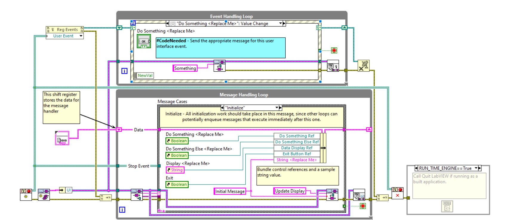
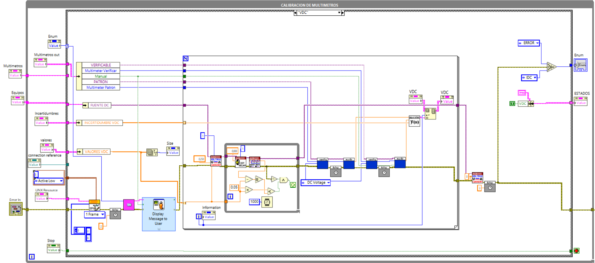
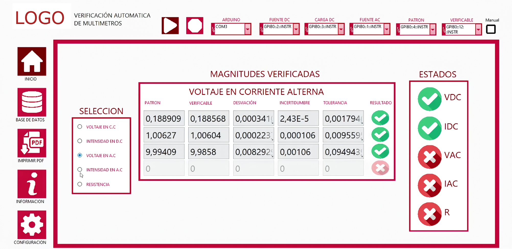

# Software — LabVIEW Control System

## Overview

This document details the software layer of the automated multimeter verification system. The application is designed as a **modular, multi-threaded control platform** developed in LabVIEW, replacing legacy linear execution models with a high-performance asynchronous architecture.

The software orchestrates real-time hardware interfacing, database persistence, and automated report generation, ensuring a responsive and fail-safe environment for metrological verification.

---

## Technology Rationale

LabVIEW was selected as the core engine due to its native deterministic dataflow, seamless integration with **NI-VISA (GPIB)**, and robust support for parallel execution patterns.

| Technology | Role | Rationale |
| :--- | :--- | :--- |
| **LabVIEW** | Core Logic | Industrial-standard for ATE (Automated Test Equipment) |
| **NI-VISA** | Communication | Standardized API for GPIB (IEEE-488) instrumentation |
| **LINX** | Hardware Abstraction | Low-latency interfacing with Arduino/Atmega328P |
| **ODBC / SQL** | Data Persistence | Native connectivity for relational database integration |
| **Python** | Post-processing | Advanced libraries for PDF generation and data analysis |

---

## Software Architecture

The application implements a **Queued Message Handler (QMH)** design pattern. This architecture decouples the user interface from the logic execution, allowing concurrent operations without blocking the main thread.

### Modular Breakdown

| Module | Architectural Role | Functional Responsibility |
| :--- | :--- | :--- |
| **UI Loop** | Event Handler | Captures user inputs and updates real-time visualization |
| **Coordinator** | Message Broker | Routes asynchronous commands between independent loops |
| **Logic Module** | Service Provider | Manages DB transactions, file I/O, and script triggers |
| **State Machine** | Process Controller | Executes the deterministic measurement sequences |

  
  
<em>Asynchronous Queued Message Handler (QMH) architecture in LabVIEW.</em>

---

## Verification Logic and Metrology

The core measurement engine operates as a **Finite State Machine (FSM)**, ensuring that every verification step follows a strict timing and stabilization protocol.

### Measurement Methodology
To guarantee data integrity and minimize noise impact, the system implements:
* **Signal Stabilization:** Programmable delays after relay switching.
* **Over-sampling:** Acquisition of 5 samples per reading point.
* **Statistical Processing:** Real-time computation of mean values and standard deviations.
* **Validation:** Comparison against tolerance limits stored in the database.

  
  
<em>Deterministic State Machine implementation for automated testing.</em>

---

## Key Features

### 1. Automated Verification Engine
Orchestrates the DC/AC voltage, current, and resistance test cycles. It manages synchronized communication between the **HP 34401A (Reference)** and the **DUT** via the GPIB bus.

### 2. Relational Data Management
Direct integration with the PostgreSQL server for:
* **Traceability:** Logging of operator ID, instrument serial numbers, and environmental conditions.
* **Historical Analysis:** Querying and filtering of previous verification results.

### 3. Automated Reporting Pipeline
Upon test completion, LabVIEW triggers a **Python post-processing script**. This script extracts the verified data via ODBC, performs final statistical validation, and generates an industrial-grade PDF report.

### 4. Integrated Documentation System
Context-aware access to technical manuals and instrument datasheets directly from the UI, managed via OS-level system calls.

---

## Operator Interface (GUI)

The interface is designed for industrial environments, prioritizing clarity and ergonomics through a **Tab-based Navigation** system.

| Dashboard | Description |
| :--- | :--- |
| **Verification** | Real-time monitoring of active test sequences and live readings |
| **Inventory** | Management and filtering of the DMM database |
| **Reports** | Visualization and export of generated PDF certificates |
| **Resources** | Datasheets, instrument imagery, and detailed process specifications |
| **Configuration** | Runtime modification of GPIB addresses and system setpoints |

  
  
<em>Global control panel and real-time monitoring interface.</em>

---

## System Constraints and Future Roadmap

### Technical Limitations
* **Polling Latency:** Current implementation relies on software-timed polling for certain hardware status updates.
* **Error Recovery:** Exception handling is centralized; localized recovery for specific instrument timeouts is in development.
* **Resource Management:** Constant CPU overhead due to non-event-driven architecture in auxiliary loops.

### Proposed Enhancements
* **Event-Driven Migration:** Fully transition all loops to User Event structures to reduce CPU idle consumption.
* **Hardware Abstraction Layer (HAL):** Implement Object-Oriented (LVOOP) classes to support heterogeneous instrument brands (e.g., Fluke, Keithley) without code changes.
* **Computer Vision:** Integration of an OCR-based module for multimeters without communication interfaces.

---

## Summary

The software platform delivers a robust, industrial-grade control solution for high-precision verification. By integrating **parallel execution patterns** in LabVIEW with **relational data management** and **Python-based reporting**, the system achieves a seamless transition from raw electrical signals to traceable technical documentation. The architecture is built for scalability, allowing the future integration of new measurement types and instrumentation with minimal core logic modifications.
